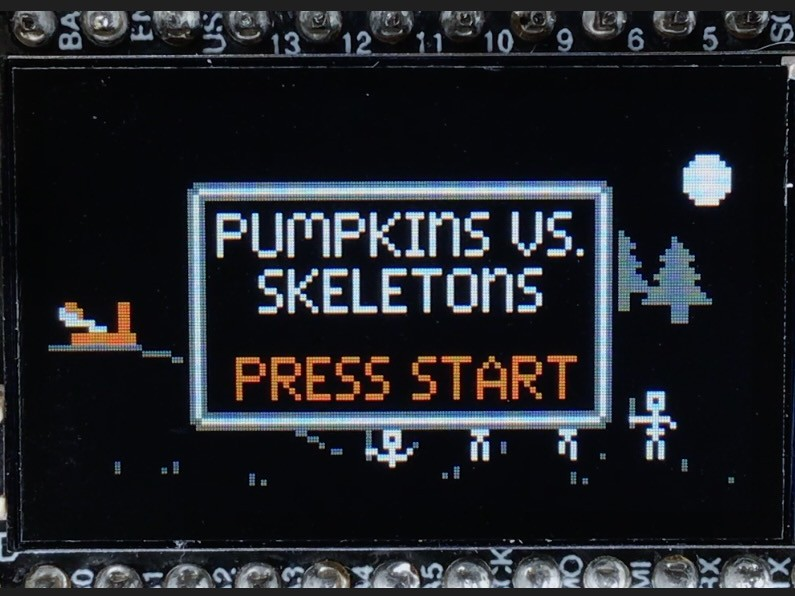
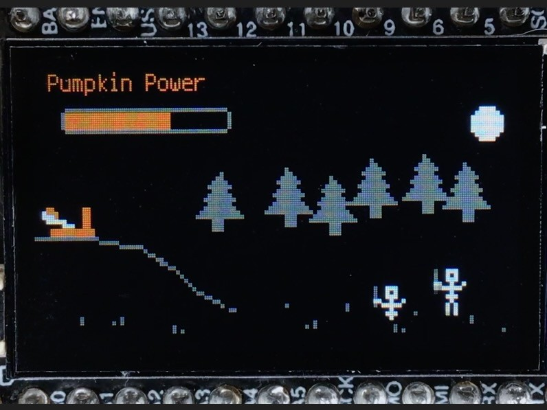
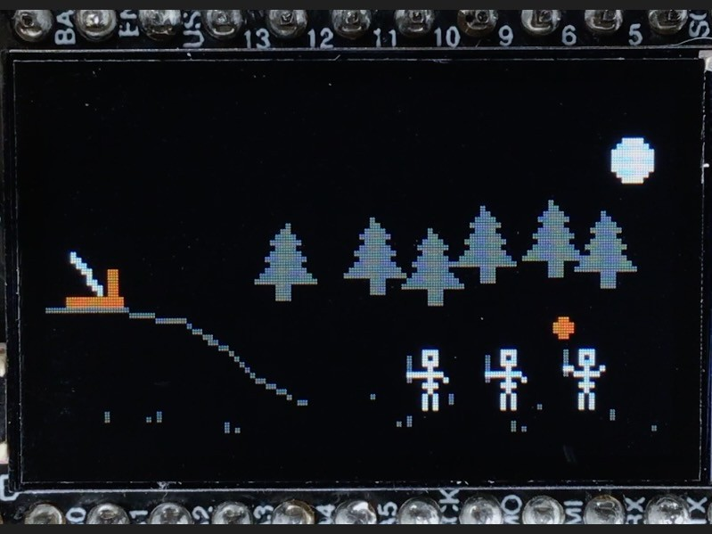
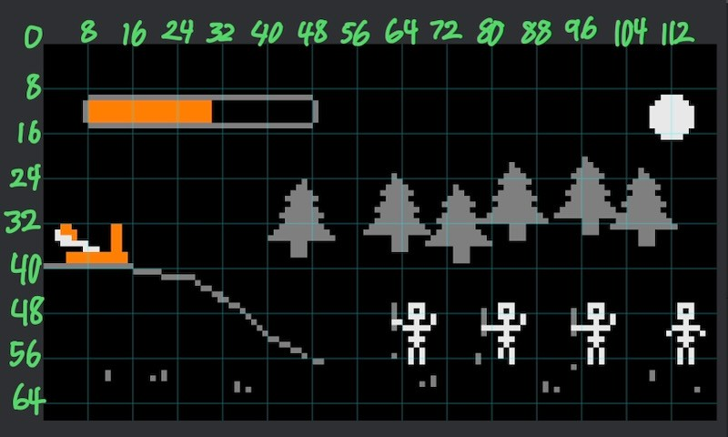
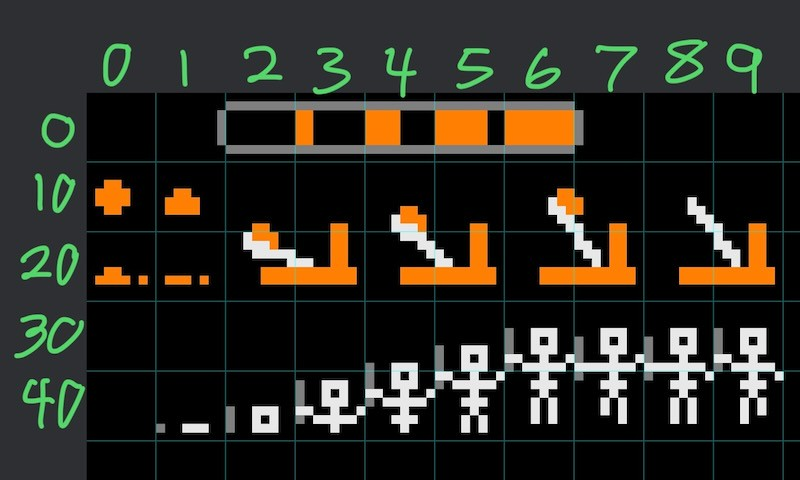

<!-- SPDX-License-Identifier: MIT -->
<!-- SPDX-FileCopyrightText: Copyright 2024 Sam Blenny -->
# Pumpkin Toss Game

This is a game about skeletons, pumpkins, and a catapult having a Spooky Season
experience in a forest clearing under the full moon. If you've thought about
making a game in CircuitPython but aren't sure where to start, this project
might be a useful source of ideas.

### Charging a Pumpkin

This is how it looks when you hold the USB gamepad's A button to charge up a
pumpkin.

### Pumpkin in Flight

This is how it looks when a pumpkin is about to meet a skeleton.

### Video Demo

There's a game play video on youtube:

https://www.youtube.com/watch?v=QStcSDSYKOE

## Hardware

This uses the setup of ESP32-S3 Feather TFT, MAX3421E USB Host FeatherWing, and
Feather Doubler that I've been using for previous USB gamepad projects. If you
want more details on the hardware and gamepad stuff, you might check out some
of my other Adafruit Playground guides:

- [Feather TFT Gamepad Tester with Sprites](https://adafruit-playground.com/u/SamBlenny/pages/feather-tft-gamepad-tester-with-sprites)

- [Feather TFT Clock with Gamepad Input](https://adafruit-playground.com/u/SamBlenny/pages/feather-tft-clock-with-gamepad-input)

### Parts

- Adafruit ESP32-S3 TFT Feather - 4MB Flash, 2MB PSRAM
  ([product page](https://www.adafruit.com/product/5483),
  [learn guide](https://learn.adafruit.com/adafruit-esp32-s3-tft-feather))

- Adafruit USB Host FeatherWing with MAX3421E
  ([product page](https://www.adafruit.com/product/5858),
  [learn guide](https://learn.adafruit.com/adafruit-usb-host-featherwing-with-max3421e))

- Adafruit FeatherWing Doubler
  ([product page](https://www.adafruit.com/product/2890))

- 8BitDo SN30 Pro USB gamepad
  ([product page](https://www.8bitdo.com/sn30-pro-usb-gamepad/))

### Pinouts

| TFT feather | USB Host | ST7789 TFT |
| ----------- | -------- | ---------- |
|  SCK        |  SCK     |            |
|  MOSI       |  MOSI    |            |
|  MISO       |  MISO    |            |
|  D9         |  IRQ     |            |
|  D10        |  CS      |            |
|  TFT_CS     |          |  CS        |
|  TFT_DC     |          |  DC        |

### Tools and Consumables

You will need soldering tools and solder.

### Soldering the Headers

The TFT Feather, USB Host FeatherWing and the Doubler all come in kit form, so
you will need to solder the headers.

If you are unfamiliar with soldering headers, you might want to read:

- [Adafruit Guide To Excellent Soldering](https://learn.adafruit.com/adafruit-guide-excellent-soldering/tools)

- [How To Solder Headers](https://learn.adafruit.com/how-to-solder-headers)

## Updating CircuitPython

**NOTE: To update CircuitPython on the ESP32-S3 TFT Feather with 2MB PSRAM and
4MB Flash, you need to use the .BIN file (combination bootloader and
CircuitPython core)**

1. Download the CircuitPython 9.1.4 **.BIN** file from the
   [Feather ESP32-S3 TFT PSRAM](https://circuitpython.org/board/adafruit_feather_esp32s3_tft/)
   page on circuitpython.org

2. Follow the instructions in the
   [Web Serial ESPTool](https://learn.adafruit.com/circuitpython-with-esp32-quick-start/web-serial-esptool)
   section of the "CircuitPython on ESP32 Quick Start" learn guide to update
   your board: first erase the flash, then program the .BIN file.

## Installing CircuitPython Code

To copy the project bundle files to your CIRCUITPY drive:

1. Download the project bundle .zip file using the button on the Playground
   guide or the attachment download link on the GitHub repo Releases page.

2. Expand the zip file by opening it, or use `unzip` in a Terminal. The zip
   archive should expand to a folder. When you open the folder, it should
   contain a `README.txt` file and a `CircuitPython 9.x` folder.

3. Open the CircuitPython 9.x folder and copy all of its contents to your
   CIRCUITPY drive.

To learn more about copying libraries to your CIRCUITPY drive, check out the
[CircuitPython Libraries](https://learn.adafruit.com/welcome-to-circuitpython/circuitpython-libraries)
section of the
[Welcome to CircuitPython!](https://learn.adafruit.com/welcome-to-circuitpython)
learn guide.

## Sprites and Background

I made sprites for this project using the Pixaki app for iPad.

My general workflow for making a spritesheet and background image is:

1. Open a new canvas of 120 pixels wide by 67 pixels high, with a black
   background and a grid with 8 pixel spacing. This lets me get a good feel for
   how things will look on a Feather TFT screen with 2x scaling using a
   `displayio.Group(scale=2)`.

2. Pick four colors for my palette (in this case black, gray, white, and orange)
   and sketch my idea for how a scene will look once the game is done. By
   separating things into different layers, it's easier to move stuff around
   and experiment.

3. Once I have a scene I like, make a new layer for the spritesheet and copy
   chunks of the other layers into the spritesheet layer, aligning the tiles
   into an 8x8 grid.

4. Hide all the other layers except the spritesheet and the background, then
   use Pixaki's PNG export feature to export the spritesheet. Also, take a a
   screenshot of the spritesheet layer with the 8x8 grid lines. Annotating this
   screenshot with sprite tile numbers makes it a lot easier to write the code
   for assembling spritesheet tiles into sprites with animation cycles.

5. Turn the spritesheet layer off, turn the other layers back on, then take a
   screenshot with the 8x8 grid lines. Annotating this screenshot with pixel
   numbers for the grid lines (0, 8, 16, 24, ...) makes it easier to set the
   x= and y= arguments when I write the code to create displayio.TileGrid
   objects for the sprites.

7. Use AirDrop to transfer the screenshots and spritesheet PNG to my mac.

### Background

### Spritesheet

## Pumpkin Flight Physics

Initially, I wanted to try accurately modelling pumpkin flight, including drag.
That got messy because the Feather TFT screen is very small, with a wide aspect
ratio, such that it's hard to show realistic trajectories for Earth gravity.

Eventually, I just started making up velocity and acceleration numbers that, in
my subjective opinion, "looked good". The math works by evaluating (x, y)
displacement for each animation frame time interval. The horizontal velocity
gets updated each animation frame with acceleration from "drag", and the
vertical velocity gets updated with acceleration from "gravity". If those
drag and gravity numbers are in any way realistic, it's purely by accident. I
just made them up. The goal here is entertainment though, so it's fine.

That said, if you want to read about accurate pumpkin flight math, some
potentially useful search terms include: rigid body dynamics, projectile
motion, classical mechanics, drag coefficient, drag equation, and ballistic
flight.

The most readily useable references I found for calculating displacement as a
function of time and initial velocity were from NASA's Glenn Research Center:
- [Ballistic Flight Calculator](https://www1.grc.nasa.gov/beginners-guide-to-aeronautics/fltcalc/)
- [Ballistic Flight Equations](https://www1.grc.nasa.gov/beginners-guide-to-aeronautics/ballistic-flight-equations/)
- [Flight Equations with Drag](https://www1.grc.nasa.gov/beginners-guide-to-aeronautics/flight-equations-with-drag/)

## Code

For this project, I made a tiny game engine from scratch in CircuitPython using
mostly built-in CircuitPython libraries. For sprites, I used displayio.TileGrid
and adafruit_imageload. For the gamepad, I used usb.core and max3421e.Max3421E.
For timing to regulate the frame rate, I used supervisor.ticks_ms.

The techniques I used are pretty straightforward, if perhaps a bit tedious. One
of the big challenges for a project like this is to stay organized so the
coordinates and sprite tile numbers don't get mixed up. To help keep sprite
tile stuff from cluttering up the rest of the code, I made two classes just for
managing sprite animation cycles: catapult.Catapult and skeletons.Skeletons.

To understand how the code works, I recommend that you start by reading through
code.py. It has extensive comments to help explain the rationale of how I
structured the code and the strategy I used to keep the frame rate smooth.
